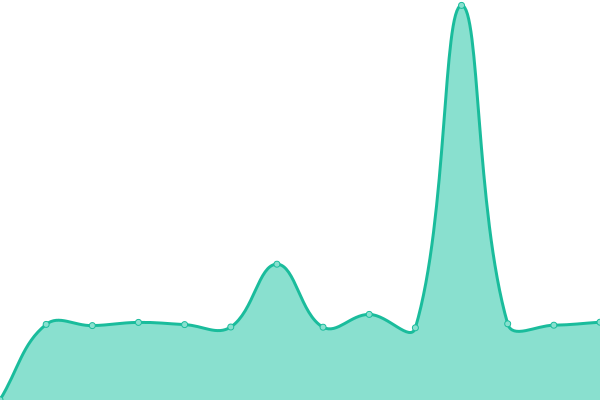

# [📈 Live Status](https://upptime.github.io/upptime): <!--live status--> **🟥 Complete outage**

This repository contains the open-source uptime monitor and status page for [Upptime](https://upptime.js.org), powered by [Upptime](https://github.com/upptime/upptime).

With [Upptime](https://upptime.js.org), you can get your own unlimited and free uptime monitor and status page, powered entirely by a GitHub repository. We use [Issues](https://github.com/upptime/upptime/issues) as incident reports, [Actions](https://github.com/kristianmsf/uptime/actions) as uptime monitors, and [Pages](https://upptime.github.io/upptime) for the status page.

<!--start: status pages-->
<!-- This summary is generated by Upptime (https://github.com/upptime/upptime) -->
<!-- Do not edit this manually, your changes will be overwritten -->
<!-- prettier-ignore -->
| URL | Status | History | Response Time | Uptime |
| --- | ------ | ------- | ------------- | ------ |
|  [KMSFHost](https://www.kmsfhost.com) | 🟥 Down | [kmsf-host.yml](https://github.com/kristianmsf/uptime/commits/HEAD/history/kmsf-host.yml) | 

 1003ms
     
 | 

<a href="https://status.kmsfhost.com/history/kmsf-host">98.40%</a>
    

|  [Kristianmsf](https://www.kristianmsf.com) | 🟥 Down | [kristianmsf.yml](https://github.com/kristianmsf/uptime/commits/HEAD/history/kristianmsf.yml) | 

 717ms
     
 | 

<a href="https://status.kmsfhost.com/history/kristianmsf">98.40%</a>
    

|  [PiHost](https://pi.kmsfhost.com) | 🟥 Down | [Pi-host.yml](https://github.com/kristianmsf/uptime/commits/HEAD/history/Pi-host.yml) | 

 245ms
     
 | 

<a href="https://status.kmsfhost.com/history/Pi-host">98.40%</a>
    

<!--end: status pages-->

[**Visit our status website →**](https://kristianmsf.github.io/uptime)

## 📄 License

- Powered by: [Upptime](https://github.com/upptime/upptime)
- Code: [MIT](./LICENSE) © [Anand Chowdhary](https://anandchowdhary.com), supported by [Pabio](https://pabio.com)
- Data in the `./history` directory: [Open Database License](https://opendatacommons.org/licenses/odbl/1-0/)
